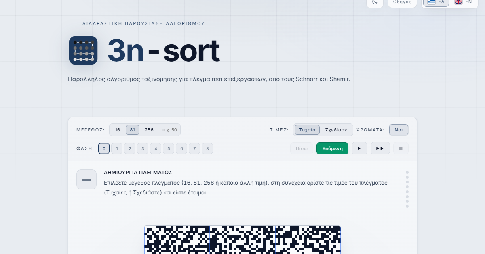

# 3n-sort: Parallel Sorting Algorithm Visualizer

**Live app: https://alexandrosliamp.github.io/3n-sort/**

An interactive, bilingual (Greek / English) visualizer of **3n-sort**, the parallel
sorting algorithm by **Schnorr and Shamir** (1986) that sorts an **n×n mesh of
processors** into snakelike order in **3n + o(n)** steps, which is optimal up to
lower-order terms.



## What it shows

- The full **8-phase algorithm** animated on a real grid (16×16 up to 256×256,
  or any custom size via padding): block sorting, the **k-way unshuffle** of
  columns, column and row sorts, and the final odd-even passes along the snake.
- True **parallel execution**: every compare-exchange pass runs on a pool of Web
  Workers over a `SharedArrayBuffer`, mirroring the mesh model instead of
  simulating it sequentially.
- **Sequential vs parallel odd-even transposition sort**, raced side by side on
  the same values: 8 time steps in parallel vs 28 sequentially.
- The **unshuffle as dealing cards**: n cards dealt round-robin to k players,
  with the original and resulting rows shown together for comparison.
- Step-by-step phase descriptions, draw-your-own-grid mode, a guided tour,
  light/dark themes, and a zoomable canvas.

## Keywords

parallel sorting algorithm · mesh-connected processor array · 3n-sort ·
Schnorr–Shamir · odd-even transposition sort · snakelike order · k-way
unshuffle · sorting visualization

## Running locally

The app needs cross-origin isolation for `SharedArrayBuffer`. Serve the files
over HTTP (a bundled service worker handles the isolation headers on hosts,
like GitHub Pages, that don't send them):

```
python -m http.server 8080
# then open http://localhost:8080/
```

## Files

- `index.html` — the entire app (single file: HTML + CSS + JS)
- `sort-worker.js` — the compare-exchange worker kernel
- `coi-serviceworker.js` — cross-origin-isolation bootstrap for header-less hosts
